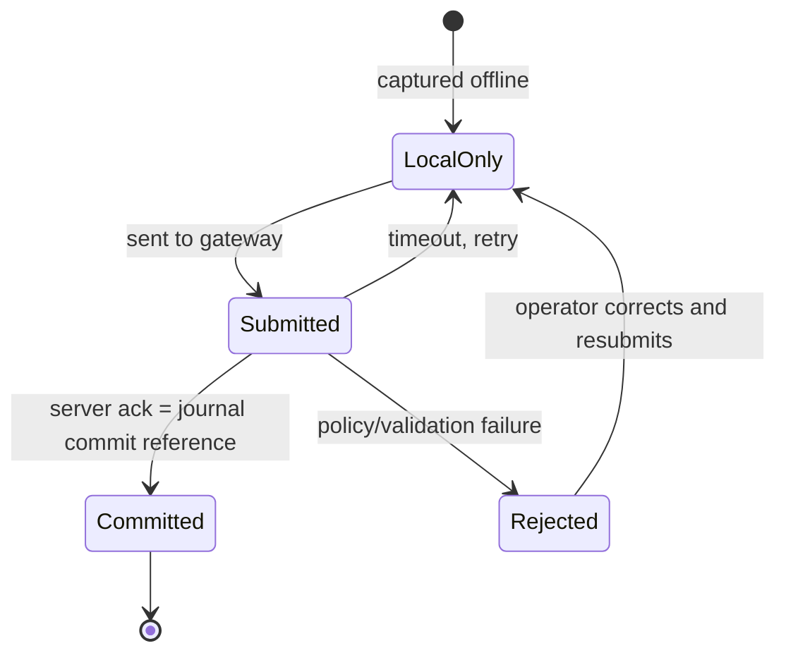

# Data handling and versioning

## Workload shapes

Three shapes, one engine (Postgres):

1. **Asset masters** — JSONB, GIN-indexed, slow-changing. `schema_version` on every master.
2. **Append-only journal** — partitioned by month, INSERT-only grants, hash-chained on custody/approval/payment events, bitemporal (`valid_time`, `transaction_time`).
3. **Current-state tables** — relational projections for fast reads. Derivable from the journal.

### Source of truth

**The journal is the source of truth. State is always derivable from the journal. If a state table disagrees with the journal, the journal wins and the state table is rebuilt.**

CDC (Debezium → Redpanda) is the only Postgres-to-Redpanda path. No application-level dual-writes. This solves the dual-write problem by making Postgres authoritative and Redpanda a derived projection of it (for the Postgres-resident data) plus the direct ingest path (for device-originated events).

### Mixed approach

Postgres core (JSONB masters, hash-chained journal, relational state) + CDC to Redpanda. This is the starting point. Full event-sourcing (journal-only, no state tables, all reads via projections) is a staged migration path if write contention or replay demands it — not the starting architecture. The journal is already event-sourcing-capable; the state tables are a performance optimization that can be removed later.

## Versioning policy (one policy across all planes)

| Plane | Mechanism | Rule |
|---|---|---|
| Events | Schema Registry, Avro | `BACKWARD_TRANSITIVE` minimum. Breaking change = new subject version + migration window. Never in-place replacement. |
| APIs (REST) | `/v1/` path version | Additive within a version. Deprecation via `Sunset` header + changelog. Breaking change = new `/v2/` path. |
| APIs (gRPC) | protobuf | Additive (new fields, new methods). Breaking change = new package or major service version. |
| CRDs | kube-native versioning | `v1` from day one. Conversion webhooks for `v1` → `v2`. |
| Documents (masters) | `schema_version` integer | Readers handle N versions. Writers write newest. Migration is additive until a breaking change. |
| Devices/apps | support window | **N-2**: server supports the current and two prior releases. |

### Support window: N-2

Server supports app/device versions N-2 (current + two prior). Below-floor devices get a forced-upgrade prompt or read-only mode, decided per persona risk:

- **Operator devices** (loading, on-board): forced-upgrade prompt; cannot perform custody operations below floor (custody is a legal accountability act; an outdated client is a liability).
- **Passenger-facing apps**: forced-upgrade prompt; read-only if declined.
- **Telemetry-only devices**: read-only (continue sending telemetry; accept config changes only at supported versions).

### Capability negotiation

Devices report their supported schema versions at connect (MQTT CONNECT payload or a first-message capability handshake). The gateway records the device's supported versions. The server sends only events/commands the device can parse; for newer schemas, the server sends the latest version the device supports or withholds (per topic policy).

### Sunset process

1. Deprecation announced (changelog, `Sunset` header, in-app banner).
2. Telemetry on old-version usage (from the analytics plane — `agents.actions`, API version headers, device capability reports).
3. Floor raised only when usage clears or exceptions are explicitly accepted (regulatory hold, contract obligation).

## Offline handoff state machine

Every locally-captured transaction on an offline device carries a client-generated **idempotency key** and moves through this state machine:



### Rules

- **"Handed off" means one thing**: the device holds a server ack containing the **journal commit reference**. Everything else is `LocalOnly` or `Submitted`. The UI must show the distinction (badge counts of unsynced items). Operators are legally responsible for custody; ambiguity is unacceptable.
- **Acks are per-event.** Resubmitting a committed idempotency key returns the original commit ref, never a duplicate.
- **Rejection is first-class.** A rejection carries a reason payload. Devices queue rejections for operator resolution; never silently drop.
- **Late syncs land with original `valid_time`.** The `transaction_time` is when the server records it; the `valid_time` is when it happened on the device. This is why the journal is bitemporal.

### Ack payload

```
Ack {
  idempotency_key: string   // the client's key
  status: "committed" | "rejected"
  journal_commit_ref: string  // commit reference, present when status=committed
  rejection_reason: string    // present when status=rejected
  server_time: timestamp
}
```

The `journal_commit_ref` is the handle the device stores as proof of handoff. It is opaque to the device; the device stores it and displays "synced" status.