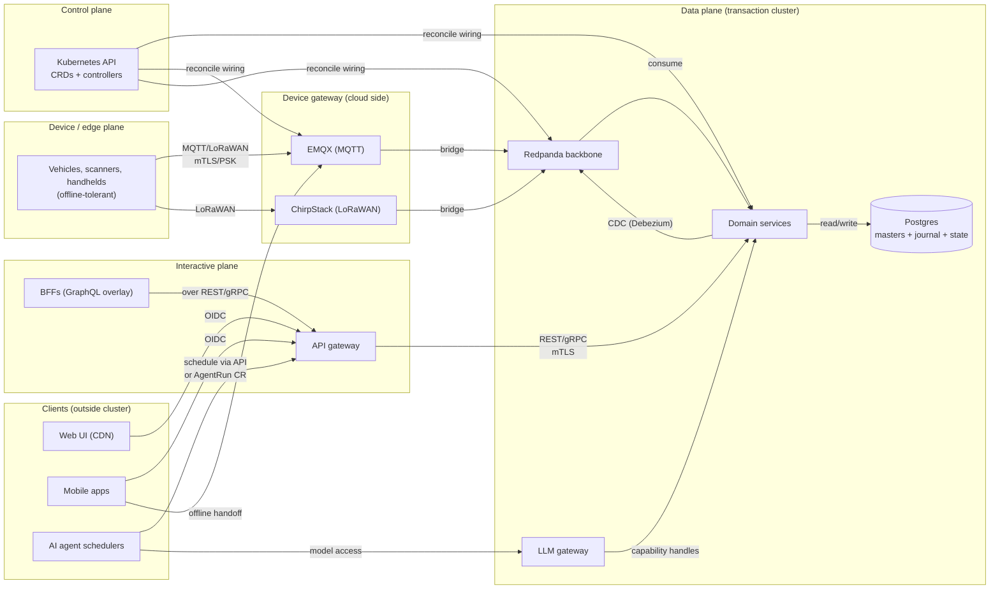

# Architecture overview

## Planes

The control plane reconciles wiring (declarative). The data plane handles all domain events and state. The interactive plane fronts clients. The device plane terminates device protocols and bridges to Redpanda. Clients live outside the transaction cluster and reach it only through gateways.

## Two front doors

| Door | Surface | Cardinality | Privilege model | Typical users |
|---|---|---|---|---|
| **kube API** | CRDs, controllers | low (hundreds–thousands of CRs) | kube RBAC, GitOps-reviewed | sysadmins, platform workflows, asset masters (partial) |
| **domain API gateway** | REST/gRPC + GraphQL overlay | high (per-row, per-field) | ABAC via OPA | account managers, loading, on-board, customer-facing (reserved) |

Both doors use the same IdP (OIDC). A third door — customer self-service — is reserved and not built this pass.

## Boundary rules

1. **UIs run outside the transaction cluster.** Static assets on a CDN; only the gateway tier is exposed to clients.
2. **Transaction clusters accept ingress solely from the gateway and device-gateway**, over mTLS. No direct client-to-service paths.
3. **No domain state and no per-event objects in the kube API.** CRDs express intent and wiring; events flow through Redpanda; state lives in Postgres.
4. **Vehicle-local safety functions never depend on the backbone.** Cluster degradation means "can't change config," never "can't operate vehicles."
5. **Device/edge and transaction cluster are distinct operational units.** A device may capture and journal locally while offline; handoff to the cloud is an explicit state transition (see `data-and-versioning.md`).

## Technology summary

| Concern | Technology | Notes |
|---|---|---|
| Control plane | Kubernetes (upstream) | dev/kind/k3d; staging/prod HA; etcd HA in prod |
| CRDs/controllers | `assetic.io/v1` group | see `cloud-components.md` §1 for full list |
| Event spine | Redpanda | Kafka API-compatible, no JVM/ZooKeeper; CR-managed topics/users |
| System of record | PostgreSQL | JSONB masters + hash-chained journal + state tables |
| CDC | Debezium → Redpanda | not dual-writes; journal is source of truth |
| Domain policy | OPA (default) | ABAC consuming custody/assignment; Cedar is an open decision |
| Device gateway | EMQX + ChirpStack | MQTT + LoRaWAN; bridge to Redpanda |
| Identity | OIDC IdP (Keycloak locally) | both doors; OAuth2 token exchange for agents |
| Envelope encryption | Vault / cloud KMS | PII payloads; sysadmin roles cannot unwrap |
| Stream processing | Flink / Kafka Streams | option flagged, not mandated (open decision) |
| LLM gateway | chokepoint service | model routing, redaction, quotas; no secrets in prompts |
| GitOps | Argo CD (default) | Flux is a viable alternative; decide before first prod deploy — `open-decisions.md` entry 9 |